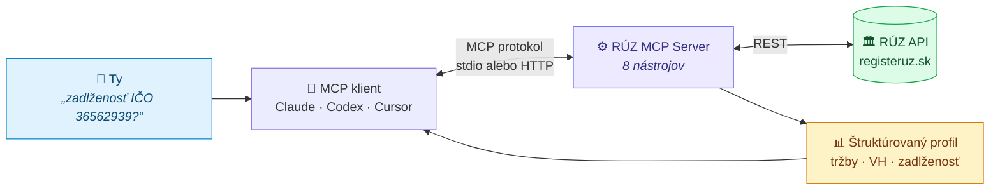
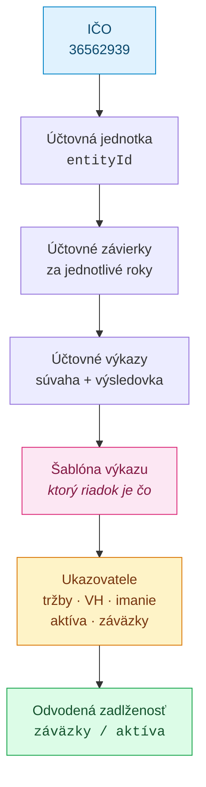
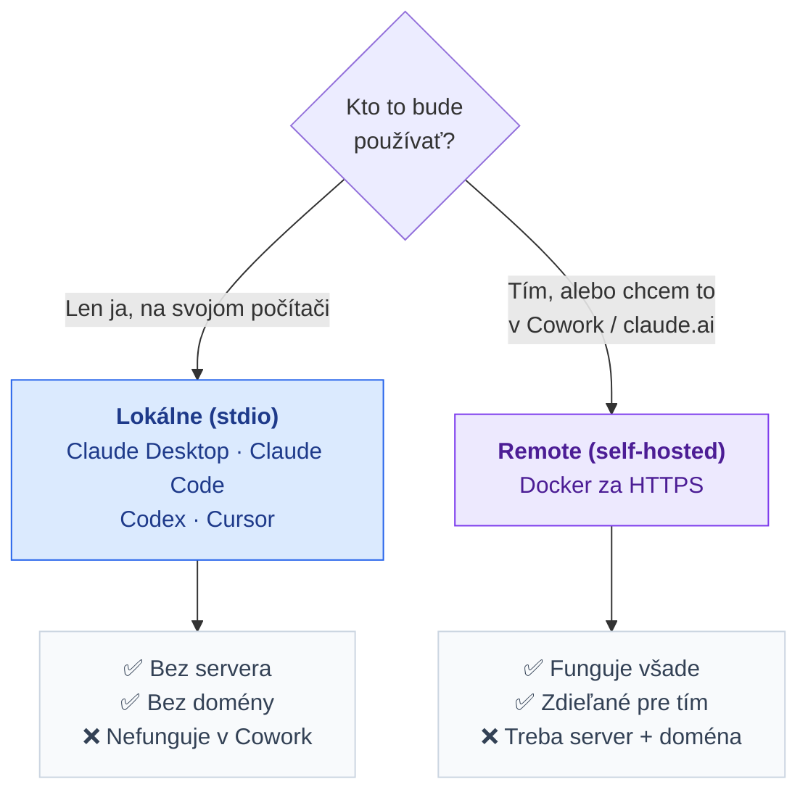
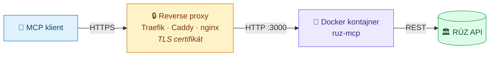

<div align="center">


<br>

[](https://modelcontextprotocol.io)
[](https://modelcontextprotocol.io/specification/2025-06-18/basic/transports)
[](https://nodejs.org)
[](https://www.typescriptlang.org)
[](LICENSE)

**MCP server nad [Registrom účtovných závierok SR](https://www.registeruz.sk).**
Podľa IČO vráti viacročný finančný profil firmy — tržby, výsledok hospodárenia,
vlastné imanie, aktíva, záväzky a zadlženosť — plus plné výkazy a originálne PDF.

<sub><i>MCP server for the Slovak Register of Financial Statements. Ask any MCP-capable
assistant for a company's multi-year financials by its IČO (company ID).</i></sub>

</div>

---

## Obsah

- [Načo to je](#načo-to-je)
- [Ako to funguje](#ako-to-funguje)
- [Ktorý režim si vybrať](#ktorý-režim-si-vybrať)
- [Inštalácia — lokálne (stdio)](#inštalácia--lokálne-stdio)
- [Inštalácia — remote (self-hosted)](#inštalácia--remote-self-hosted)
- [Autentifikácia](#autentifikácia)
- [Nástroje](#nástroje)
- [Príklady](#príklady)
- [Konfigurácia](#konfigurácia)
- [Riešenie problémov](#riešenie-problémov)
- [Vývoj](#vývoj)
- [Limity a hrany](#limity-a-hrany)

---

## Načo to je

RÚZ zverejňuje účtovné závierky všetkých slovenských firiem, ale cez web sa v nich
listuje ručne — PDF po PDF. Tento server to sprístupní asistentovi ako nástroje, takže
sa vieš spýtať *„aká je zadlženosť firmy s IČO 36562939 za posledné 3 roky?"* a dostaneš
štruktúrovanú odpoveď.

Typické použitie: **preverovanie klienta a protistrany** (KYC/AML), due diligence,
rýchly finančný sanity-check pred podpisom zmluvy.

> [!NOTE]
> Server dáta iba **číta**. Nič neukladá, nemení ani neposiela ďalej.
> Všetky dáta sú verejné otvorené dáta MF SR.

---

## Ako to funguje



Server preloží jedno IČO na reťaz volaní RÚZ API (jednotka → závierky → výkazy →
šablóny), vytiahne z výkazov správne riadky podľa šablóny a poskladá z nich profil:



---

## Ktorý režim si vybrať



| | Lokálne (stdio) | Remote (self-hosted) |
|---|---|---|
| Treba server | nie | áno |
| Treba doména + HTTPS | nie | áno |
| Claude Desktop | ✅ | ✅ |
| Claude Code | ✅ | ✅ |
| Codex CLI | ✅ | ✅ |
| Cursor / VS Code | ✅ | ✅ |
| **Cowork / claude.ai** | ❌ | ✅ |
| Zdieľanie v tíme | ❌ | ✅ |

> [!IMPORTANT]
> **Cowork, claude.ai a Claude Desktop connectors vedia iba remote servery.** Lokálne
> stdio servery tam nepridáš — a naopak, Anthropic sa na tvoj remote server pripája
> **zo svojej cloud infraštruktúry**, nie z tvojho počítača. Server teda musí byť
> dostupný z verejného internetu (nie za VPN alebo firewallom).

---

## Inštalácia — lokálne (stdio)

### Požiadavky

- **Node.js ≥ 22** — over `node --version`
- **git**

### 1. Stiahni a zbuilduj

```bash
git clone https://github.com/originalmagneto/RUZ-MCP.git
cd RUZ-MCP
npm install
npm run build
```

### 2. Over, že to beží

```bash
npm test
```

Očakávaný výsledok: `Tests 12 passed (12)`.

### 3. Zisti absolútnu cestu

Do konfigurácie klienta musíš dať **absolútnu** cestu:

```bash
pwd
# napr. /Users/tvojmeno/RUZ-MCP  →  server je /Users/tvojmeno/RUZ-MCP/dist/server.js
```

### 4. Zaregistruj do klienta

<details open>
<summary><b>🖥️ Claude Desktop</b></summary>

Otvor konfiguračný súbor:

| OS | Cesta |
|---|---|
| macOS | `~/Library/Application Support/Claude/claude_desktop_config.json` |
| Windows | `%APPDATA%\Claude\claude_desktop_config.json` |
| Linux | `~/.config/Claude/claude_desktop_config.json` |

Pridaj (cestu nahraď svojou):

```json
{
  "mcpServers": {
    "ruz": {
      "command": "node",
      "args": ["/ABSOLUTNA/CESTA/RUZ-MCP/dist/server.js"]
    }
  }
}
```

Reštartuj Claude Desktop. Nástroje sa objavia pod ikonou 🔌.

</details>

<details>
<summary><b>⌨️ Claude Code</b></summary>

```bash
claude mcp add --scope user ruz -- node /ABSOLUTNA/CESTA/RUZ-MCP/dist/server.js
```

Overenie:

```bash
claude mcp get ruz
```

Očakávaný výstup obsahuje `Status: ✔ Connected`. Odobrať sa dá cez
`claude mcp remove ruz -s user`.

</details>

<details>
<summary><b>🔷 Codex CLI</b> — <code>~/.codex/config.toml</code></summary>

```toml
[mcp_servers.ruz]
command = "node"
args = ["/ABSOLUTNA/CESTA/RUZ-MCP/dist/server.js"]
```

</details>

<details>
<summary><b>📝 Cursor</b> — <code>~/.cursor/mcp.json</code></summary>

```json
{
  "mcpServers": {
    "ruz": {
      "command": "node",
      "args": ["/ABSOLUTNA/CESTA/RUZ-MCP/dist/server.js"]
    }
  }
}
```

</details>

<details>
<summary><b>🟦 VS Code</b> — <code>.vscode/mcp.json</code></summary>

```json
{
  "servers": {
    "ruz": {
      "type": "stdio",
      "command": "node",
      "args": ["/ABSOLUTNA/CESTA/RUZ-MCP/dist/server.js"]
    }
  }
}
```

</details>

<details>
<summary><b>🧪 Ručný test bez klienta</b></summary>

```bash
printf '%s\n' \
  '{"jsonrpc":"2.0","id":1,"method":"initialize","params":{"protocolVersion":"2025-06-18","capabilities":{},"clientInfo":{"name":"t","version":"1"}}}' \
  '{"jsonrpc":"2.0","method":"notifications/initialized"}' \
  '{"jsonrpc":"2.0","id":2,"method":"tools/list","params":{}}' \
  | node dist/server.js
```

Vráti `initialize` odpoveď a zoznam 8 nástrojov.

</details>

---

## Inštalácia — remote (self-hosted)

Remote režim potrebuješ, ak to chceš používať v **Cowork / claude.ai** alebo zdieľať
v tíme. Princíp:



### Varianta A — Docker

```bash
git clone https://github.com/originalmagneto/RUZ-MCP.git
cd RUZ-MCP
docker build -t ruz-mcp .
docker run -d --name ruz-mcp -p 3000:3000 \
  -e PORT=3000 \
  -e MCP_AUTH_MODE=authless \
  -e MCP_PUBLIC_URL=https://tvoja-domena.sk \
  ruz-mcp
```

Overenie:

```bash
curl http://localhost:3000/healthz
# {"status":"ok","service":"ruz-mcp","auth":"authless"}
```

### Varianta B — Docker Compose

Repo obsahuje `docker-compose.dokploy.yml` (funguje aj v čistom Compose):

```bash
MCP_PUBLIC_URL=https://tvoja-domena.sk docker compose -f docker-compose.dokploy.yml up -d
```

### Varianta C — Dokploy / Coolify / CapRover

1. Vytvor **Compose** službu z tohto git repozitára
2. Nastav premenné prostredia (viď [Konfigurácia](#konfigurácia)) — minimálne
   `PORT=3000` a `MCP_PUBLIC_URL=https://tvoja-domena.sk`
3. Priraď doménu, cieľový port **3000**, zapni HTTPS (Let's Encrypt)
4. Deploy

### 3. Priraď doménu a HTTPS

MCP klienti vyžadujú **HTTPS**. Bez platného certifikátu sa nepripoja.
Server sám TLS nerieši — postav pred neho reverse proxy.

<details>
<summary><b>Caddy</b> (najjednoduchšie — certifikát automaticky)</summary>

```caddyfile
mcp.tvoja-domena.sk {
    reverse_proxy localhost:3000
}
```

</details>

<details>
<summary><b>nginx</b></summary>

```nginx
server {
    listen 443 ssl;
    server_name mcp.tvoja-domena.sk;

    ssl_certificate     /etc/letsencrypt/live/mcp.tvoja-domena.sk/fullchain.pem;
    ssl_certificate_key /etc/letsencrypt/live/mcp.tvoja-domena.sk/privkey.pem;

    location / {
        proxy_pass         http://127.0.0.1:3000;
        proxy_http_version 1.1;
        proxy_set_header   Host              $host;
        proxy_set_header   X-Forwarded-For   $proxy_add_x_forwarded_for;
        proxy_set_header   X-Forwarded-Proto $scheme;

        # Streamable HTTP posiela odpovede prúdovo — nebufferovať
        proxy_buffering    off;
        proxy_read_timeout 300s;
    }
}
```

</details>

### 4. Zaregistruj do klienta

Endpoint je vždy `https://tvoja-domena.sk/mcp`.

<details open>
<summary><b>☁️ Cowork / claude.ai / Claude Desktop</b></summary>

1. **Settings → Connectors**
2. *Add custom connector*
3. Vlož URL: `https://tvoja-domena.sk/mcp`
4. *Advanced settings* nechaj prázdne (pri `authless` režime)
5. **Add**, potom **Connect**

</details>

<details>
<summary><b>⌨️ Claude Code</b></summary>

```bash
claude mcp add --scope user --transport http ruz https://tvoja-domena.sk/mcp
```

S bearer tokenom:

```bash
claude mcp add --scope user --transport http ruz https://tvoja-domena.sk/mcp \
  --header "Authorization: Bearer TVOJ_TOKEN"
```

</details>

<details>
<summary><b>🔷 Codex CLI</b></summary>

```toml
[mcp_servers.ruz]
url = "https://tvoja-domena.sk/mcp"
# voliteľne, pri MCP_AUTH_MODE=bearer:
# bearer_token_env_var = "RUZ_MCP_TOKEN"
```

</details>

---

## Autentifikácia

Server má tri režimy. Ktorý beží, hlási `/healthz` v poli `auth`.

| | `authless` *(default)* | `bearer` | `oauth` |
|---|---|---|---|
| Nastavenie | nič netreba | `MCP_AUTH_MODE=bearer` + `MCP_BEARER_TOKEN` | `MCP_AUTH_MODE=oauth` + `OAUTH_AUTHORIZATION_PASSWORD` |
| Claude Code | ✅ | ✅ cez `--header` | ✅ |
| Codex CLI | ✅ | ✅ cez `bearer_token_env_var` | ✅ |
| **Cowork / claude.ai** | ✅ | ❌ nefunguje | ✅ |
| Ochrana | rate limiting | token + rate limiting | vlastný grant na klienta |

RÚZ sú verejné otvorené dáta, takže `authless` je legitímna voľba a zostáva
predvolený. Dáva ale prístup k serveru komukoľvek, kto pozná URL — vrátane
záťaže smerom na upstream RÚZ z tvojej adresy. Preto je pre remote nasadenie
odporúčaný `oauth`.

> [!NOTE]
> Cowork a claude.ai konektory vedia poslať len URL a OAuth údaje, **vlastné
> hlavičky neposielajú** — statický bearer token tam teda pripojiť nejde.
> Režim `oauth` tento problém nemá, lebo prihlásenie prebieha v prehliadači.

### Prečo OAuth namiesto tokenu

Bearer token je **jeden zdieľaný reťazec** pre všetkých klientov. Nedá sa zrušiť
pre jedného a nerotuje sa. V OAuth režime má každý klient vlastný grant, ktorý
sa dá zrušiť samostatne.

### Ako prebieha OAuth prihlásenie

1. Klient sa zaregistruje cez **DCR** (`POST /register`).
2. Otvorí `/authorize`. Server zobrazí **prihlásenie a vypýta heslo**.
3. Po prihlásení príde **obrazovka súhlasu**.
4. Až potom sa vydá authorization code, ktorý sa vymení za token.

Samotná registrácia klienta teda nič neodomkne. Podporované je **iba PKCE
`S256`**; `code_challenge` aj `code_verifier` musia mať 43–128 znakov z RFC 7636
množiny a server overuje hash aj na svojej strane.

Konfigurácia je **fail-closed** — bez autorizačného hesla (min. 16 znakov),
bez durable úložiska tokenov, s non-https issuerom, zlým scope alebo nekladným
TTL server zámerne nenabehne.

### OAuth premenné

| Premenná | Predvolené | Význam |
|---|---|---|
| `MCP_AUTH_MODE` | `authless` | `oauth` zapne OAuth režim. |
| `OAUTH_ISSUER_URL` | `MCP_PUBLIC_URL` | Kanonický HTTPS issuer. |
| `OAUTH_AUTHORIZATION_PASSWORD` | — | **Povinné v OAuth režime**, min. 16 znakov. |
| `OAUTH_TOKEN_STORE_PATH` | `/data/oauth.json` | Durable stav; potrebuje persistent volume. |
| `OAUTH_SCOPES` | `mcp:tools` | Podporované scopes. |
| `OAUTH_ENABLE_DYNAMIC_CLIENT_REGISTRATION` | `true` | Zapne DCR. |
| `OAUTH_MAX_LIVE_GRANTS_PER_CLIENT` | `64` | Limit živých tokenov na klienta. |
| `TRUSTED_PROXY_CIDRS` | — | CIDR reverznej proxy, napr. `172.20.1.1/32`. |

Compose obsahuje premenné aj volume `ruz-oauth-data:/data`. Oboje je potrebné:
premenná sa do kontajnera dostane, **iba ak je uvedená v `environment:`** bloku,
a bez volume by tokeny zmizli pri každom reštarte. Použi **jednu repliku**.

V režimoch `bearer` aj `oauth` vráti neautorizovaná požiadavka `401` s hlavičkou
podľa [RFC 9728](https://datatracker.ietf.org/doc/html/rfc9728):

```http
WWW-Authenticate: Bearer realm="mcp", resource_metadata="https://tvoja-domena.sk/.well-known/oauth-protected-resource"
```

V režime `authless` chráni otvorený endpoint **rate limiting** (`MCP_RATE_LIMIT`,
default 120 requestov za minútu na IP), hlavne preto, aby cez server nikto
nehamroval upstream RÚZ API.

---

## Nástroje

| Nástroj | Parametre | Vracia |
|---|---|---|
| `ruz_find_entity` | `ico?` · `dic?` | účtovnú jednotku vrátane `entityId` |
| `ruz_financial_profile` | `ico` · `years?` *(1–15, def. 5)* · `consolidated?` | viacročný profil s ukazovateľmi |
| `ruz_list_statements` | `ico?` · `entityId?` | zoznam účtovných závierok |
| `ruz_get_statement` | `statementId` | detail závierky + metadáta výkazov |
| `ruz_get_report` | `reportId` | plný čitateľný výkaz (súvaha / výsledovka) |
| `ruz_list_annual_reports` | `ico?` · `entityId?` | zoznam výročných správ |
| `ruz_list_attachments` | `statementId?` · `reportId?` · `annualReportId?` | zoznam PDF príloh |
| `ruz_download_attachment` | `attachmentId` · `savePath?` | PDF ako base64, alebo uloží na disk |

**Ukazovatele v `ruz_financial_profile`:** `revenue` (tržby), `profit` (výsledok
hospodárenia), `equity` (vlastné imanie), `assets` (aktíva), `liabilities` (záväzky),
`leverage` (zadlženosť = záväzky / aktíva).

---

## Príklady

**Viacročný profil**

```jsonc
// ruz_financial_profile { "ico": "36562939", "years": 2 }
```

| Rok | Tržby | VH | Vlastné imanie | Aktíva | Záväzky | Zadlženosť |
|---|---|---|---|---|---|---|
| 2025 | 560 556 309 | 5 404 153 | 9 944 895 | 126 626 420 | 116 610 558 | 0,92 |
| 2024 | 489 984 554 | 4 460 127 | 4 540 742 | 98 039 110 | 93 435 662 | 0,95 |

**Reťazenie s ORSR** — RÚZ API hľadá len podľa IČO/DIČ. Ak máš len názov firmy,
najprv si nechaj dohľadať IČO (napr. cez ORSR MCP alebo [orsr.sk](https://www.orsr.sk))
a to potom posuň do `ruz_financial_profile`.

**Stiahnutie PDF na disk**

```jsonc
// ruz_download_attachment { "attachmentId": 11908432, "savePath": "/tmp/zavierka.pdf" }
```

Bez `savePath` sa PDF vráti ako base64 — pri veľkých prílohách radšej ukladaj na disk.

---

## Konfigurácia

| Premenná | Default | Popis |
|---|---|---|
| `PORT` | `8790` | HTTP port (Docker image používa `3000`) |
| `MCP_AUTH_MODE` | `authless` | `authless` alebo `bearer` |
| `MCP_BEARER_TOKEN` | — | povinný pri `MCP_AUTH_MODE=bearer` |
| `MCP_PUBLIC_URL` | — | verejná base URL, bez lomky na konci — pre RFC 9728 metadáta |
| `MCP_AUTHORIZATION_SERVER` | — | OAuth issuer, ak server postavíš za vlastný AS |
| `MCP_RATE_LIMIT` | `120` | requestov na okno a IP (`0` = vypnuté) |
| `MCP_RATE_WINDOW_MS` | `60000` | dĺžka okna v ms |

### Endpointy

| Cesta | Popis |
|---|---|
| `POST /mcp` | MCP Streamable HTTP (stateless) |
| `GET /healthz` | health check — vracia aj aktívny auth režim |
| `GET /.well-known/oauth-protected-resource` | RFC 9728 Protected Resource Metadata |

---

## Riešenie problémov

<details>
<summary><b>Klient server nevidí / „no tools"</b></summary>

- Použil si **absolútnu** cestu k `dist/server.js`? Relatívna nefunguje.
- Spustil si `npm run build`? Bez `dist/` sa server nespustí.
- Reštartoval si klienta? Claude Desktop načíta konfiguráciu len pri štarte.
- Over ručne: `node /cesta/dist/server.js` — nemá nič vypísať a má bežať ďalej.

</details>

<details>
<summary><b>Remote server sa nepripojí</b></summary>

- Je dostupný z verejného internetu? Anthropic sa pripája **zo svojich cloud IP**,
  nie z tvojho počítača — `localhost`, VPN ani firewall nefungujú.
- Má **platný HTTPS** certifikát? Self-signed klient odmietne.
- Vracia `curl https://tvoja-domena.sk/healthz` status `ok`?
- Máš `MCP_AUTH_MODE=bearer` a skúšaš to v Cowork? To nefunguje — viď
  [Autentifikácia](#autentifikácia).

</details>

<details>
<summary><b>Dostávam 429 Rate limit exceeded</b></summary>

Prekročil si `MCP_RATE_LIMIT` (default 120/min na IP). Zvýš ho, alebo nastav `0`
pre vypnutie. Pri viacerých používateľoch za jednou NAT IP zdieľajú jeden limit.

</details>

<details>
<summary><b>Profil vracia <code>structuredDataAvailable: false</code></b></summary>

RÚZ pre danú závierku nezverejňuje štruktúrovaný obsah. `attachmentHint` povie,
o ktorý prípad ide — IFRS závierka, správa audítora, alebo **Výkaz vybraných
údajov (VÚ POD)**. Použi `ruz_list_attachments` + `ruz_download_attachment`
a čítaj PDF.

Pri VÚ POD to nie je len chýbajúci obsah: šablóna síce deklaruje šesť tabuliek,
ale sú pomenované genericky („I.: Tab. č. 1") a **riadky nemajú názvy vôbec**.
Ukazovatele sa preto nedajú odvodiť ani vtedy, keby konkrétna závierka bunky
niesla — vyžadovalo by to mapu čísel riadkov pre každú verziu šablóny.

</details>

<details>
<summary><b>Profil trvá dlho</b></summary>

Profil za `N` rokov znamená `N` sérií volaní na RÚZ API. Pri veľkých firmách to sú
sekundy. Zníž `years`, ak potrebuješ rýchlu odpoveď.

</details>

---

## Vývoj

```bash
npm run typecheck    # tsc --noEmit
npm test             # unit testy (offline, na fixtures)
npm run test:live    # testy proti živému RÚZ API
npm run build        # → dist/

npm run start        # stdio (cez tsx, bez buildu)
npm run start:http   # Streamable HTTP na :8790
```

### Štruktúra

| Súbor | Zodpovednosť |
|---|---|
| `src/server.ts` | stdio entrypoint |
| `src/server-http.ts` | HTTP entrypoint — auth, rate limiting, CORS, RFC 9728 |
| `src/mcp-server.ts` | definície 8 nástrojov |
| `src/ruz-client.ts` | HTTP klient pre RÚZ API + cache šablón |
| `src/financials.ts` | extrakcia ukazovateľov z výkazov podľa šablóny |

---

## Limity a hrany

- **IFRS / banky / oznámenia** — prázdny štruktúrovaný obsah, nástroje vrátia
  `structuredDataAvailable: false` a odkážu na PDF prílohu. **Pole `indicators`
  má vždy všetkých šesť kľúčov** (`revenue`, `profit`, `equity`, `assets`,
  `liabilities`, `leverage`); nedostupný ukazovateľ je `available: false`,
  nikdy nechýba. Tvar odpovede teda nezávisí od šablóny závierky.
- **Výpadok RÚZ** — `registeruz.sk` servíruje odstávkovú stránku ako HTML
  s **HTTP 200**, takže sa nedá rozpoznať podľa stavového kódu. Klient ju
  rozpozná podľa tela a vráti `RuzUnavailableError` („register je momentálne
  nedostupný"), nie chybu parsera.
- **Neverejné jednotky** vrátia len `stav`.
- **Vyhľadávanie len podľa IČO/DIČ** — nie podľa názvu. RÚZ API to inak nevie.
- **Rate limiting je in-memory** — pri viacerých replikách má každá vlastný počítadlo.

### Kompatibilita s MCP

Server hovorí protokol **2025-06-18** cez Streamable HTTP v stateless režime
(bez `Mcp-Session-Id`), postavený na `@modelcontextprotocol/sdk` 1.30.
Revízia **2026-07-28** zavádza bezstavové jadro bez `initialize` handshaku a nové
`server/discover`; klienti zatiaľ negociujú spätne kompatibilne, migrácia je
samostatná úloha.

---

## Zdroj dát

[Register účtovných závierok](https://www.registeruz.sk) — otvorené dáta Ministerstva
financií SR. Tento projekt nie je s MF SR nijako spojený.

## Licencia

[MIT](LICENSE)
